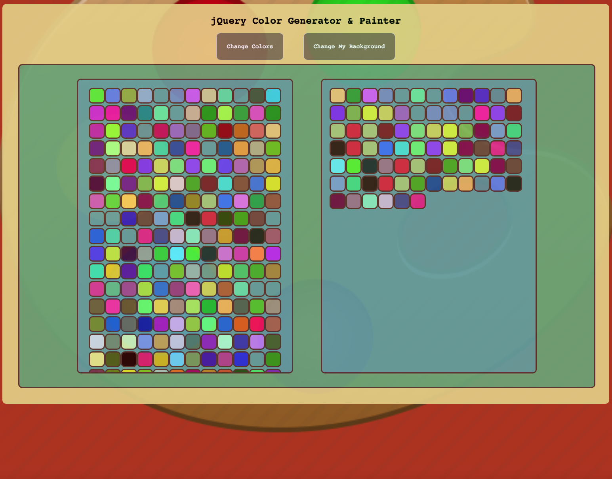
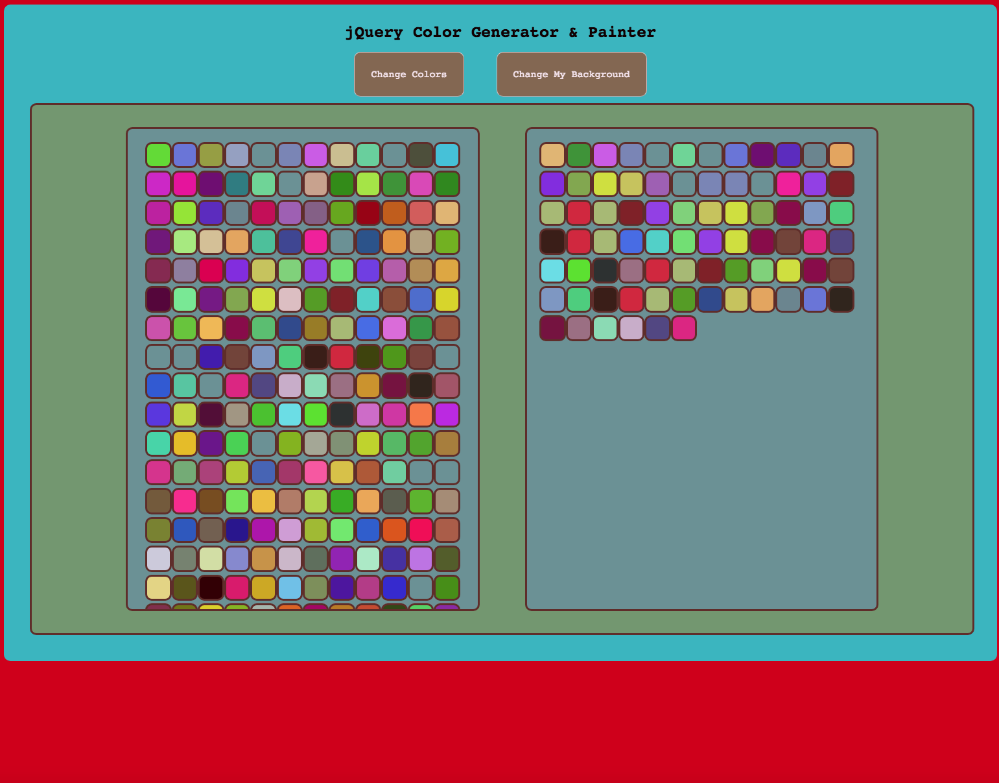
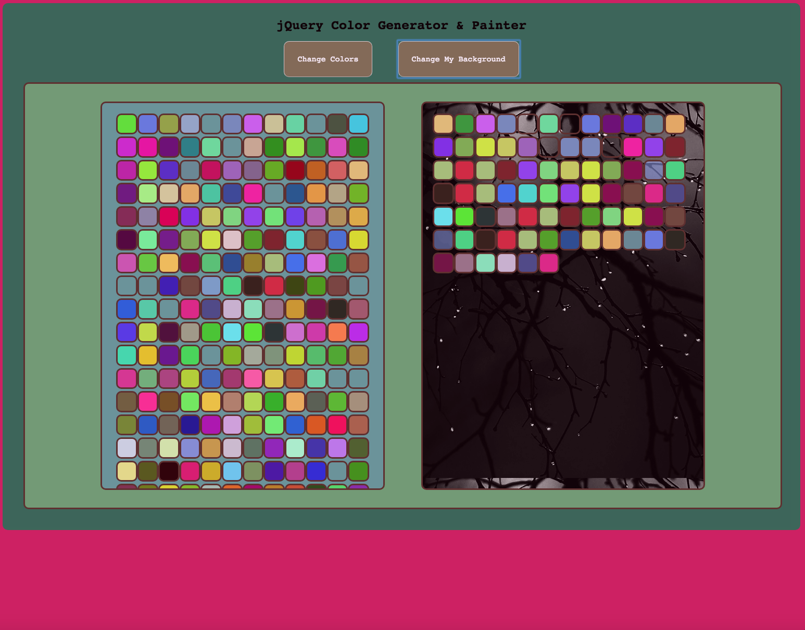

# [jQuery Color Generator & Painter](https://jquery-painter.herokuapp.com/index.html)
#### Please Click Link Above to View Live Heroku Deployment.

 

  

  
  

A responsive app written in jQuery where the user can use mouseover or click to add colors to their "paint" box.  On click the HTML & Body color elements change to a random color (on HTML click, only the HTML element's color will change), and clicking the Change Color button, the palette box will refresh colors to an array of new random colors.

#### To view the site's Heroku deployment, click the name/link on top of this page or you can view [here](https://jquery-painter.herokuapp.com/index.html).

##### [Amit](https://amitzaman.com/)
